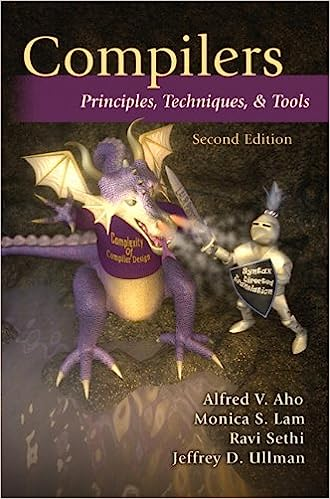
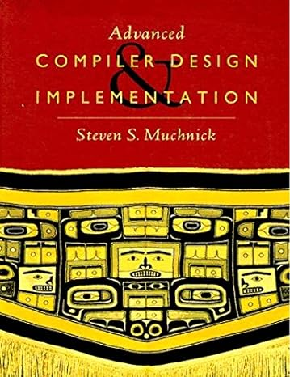
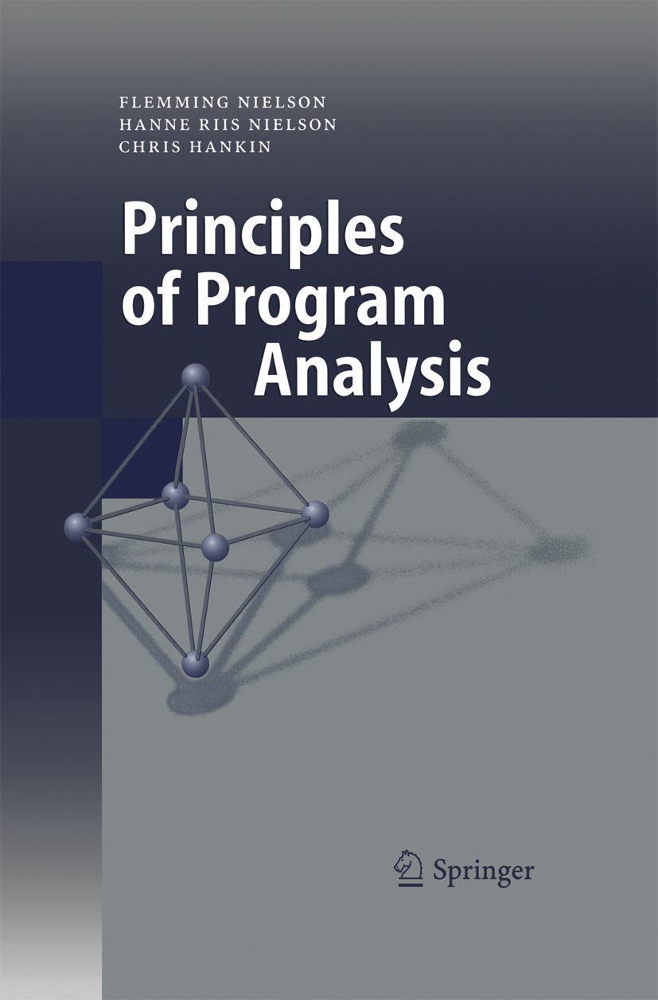

# Потоковый анализ

::::::: columns
::::: {.column width=50%}

## Потоковый анализ

\up
- Статический
- Глобальный (весь CFG)
- Зависит от потока управления
- Вычисление свойств исполнения программы
- Единая формальная модель и теория

## Применение

\up
- Reaching definitions (use-def links)
- Live-variable analysis
- Constant propagation
- Constant subexpression elimination
- Dead code elimination

:::::
\vline
::::: {.column width=48%}

```{=latex}
\begin{minipage}[c][0.7\textheight][c]{\columnwidth}
```

```{=latex}
\gdef \cfg {
\begin{scope}[
    ->,>=latex,
    every node/.style={font=\footnotesize\ttfamily,align=left},
    base/.style={minimum width={4em},minimum height={2em},inner sep=1em,outer sep=auto},
    n/.style={base,draw,solid},
    block/.style={n,rectangle},
    tiny block/.style={block,scale=0.5},
    large block/.style={block,minimum width=7em},
    every matrix/.style={row sep=1.5em,column sep=-1.5em,ampersand replacement=\&,every node/.style={block}},
  ]

  \matrix {
  \& \node [large block] (entry) {entry}; \& \\
  \node (left) {x = 1\\y = 2}; \& \& \node (right) {x = 2\\y = 1}; \\
  \& \node [large block] (merge point) {z = x + y}; \& \\
  \& \node [large block] (exit) {ret(z)}; \& \\
  };
  \graph [use existing nodes] {
    entry -> {left, right} -> merge point -> exit
  };

\end{scope}
}
```

```{=latex}
\centering
\begin{tikzpicture}
  \cfg
\end{tikzpicture}
```

```{=latex}
\end{minipage}
```


:::::
:::::::

# Пример

::::::: columns
::::: {.column width=50%}

```{=latex}
\gdef \dataflowenv {
```

:::: {.block}

## Окружение потокового анализа

\up
- Потоковый граф $G = \langle V, E, v_{entry}, v_{exit} \rangle$
- Направление анализа $D \in \{ \downarrow, \uparrow \}$
- Полурешетка свойств $\langle L, \wedge \rangle$ огр. сверху
- Преобразователи свойств $f_{v \in V}\colon L \to L$
- Начальная разметка $in_0(v) = out_0(v) = \top$

::::

```{=latex}
}
```

```{=latex}
\uncover<+(1)->{
```

\dataflowenv

\vspace{1em}
\hrule

```{=latex}
\uncover<+(1)->{
```

```{=latex}
\uncover<+>{}
```

```{=latex}
\begin{minipage}[c][0.4\textheight][c]{\columnwidth}
```

```{=latex}

\newcommand{\entrynode}{.(0)-.(1)}
\newcommand{\magentanode}{.(2)-.(3)}
\newcommand{\cyannode}{.(4)-.(5),.(10)-.(11)}
\newcommand{\yellownode}{.(8)-.(9)}
\newcommand{\meetnode}{.(6)-.(7),.(12)-.(13)}
\newcommand{\exitnode}{.(14)-.(15)}

\centering
\begin{tikzpicture}[
    ->,>=latex,
    every node/.style={inner sep=0.2em,font=\footnotesize},
    base/.style={minimum width={1.5em},minimum height={1.5em},inner sep=0,outer sep=auto},
    n/.style={base,draw,solid},
    block/.style={n,circle},
    tiny block/.style={block,scale=0.5},
    every matrix/.style={row sep=1.5em,column sep=0.5em,ampersand replacement=\&,every node/.style={block}},
    visible on/.style={alt=####1{}{invisible}},
    left input/.style={
      visible on=<{\cyannode,\meetnode,\exitnode}>,
      alt=<{\meetnode}>{magenta}{},
      alt=<{\meetnode}>{background fill=magenta!50,fill}{},
      alt=<{\exitnode}>{background fill=black!50,fill}{},
    },
    middle input/.style={
      visible on=<{\magentanode,\yellownode}>,
      alt=<{\yellownode}>{cyan}{},
      alt=<{.(8)-.(9)}>{background fill=cyan!50,fill}{},
    },
    right input/.style={
      visible on=<{\cyannode,\meetnode,\exitnode}>,
      alt=<{\cyannode}>{yellow}{},
      alt=<{\meetnode}>{cyan}{},
      alt=<{\exitnode}>{yellow}{},
      alt=<{.(6)-.(7)}>{background fill=cyan!50,fill}{},
      alt=<{.(10)-.(15)}>{background fill=green!50,fill}{},
    },
    in value/.style={
      alt=<{.(6)-.(7)}>{background fill=blue!50,fill}{},
      alt=<{.(8)-.(9)}>{background fill=cyan!50,fill}{},
      alt=<{.(10)-.(11)}>{background fill=green!50,fill}{},
      alt=<{.(12)-.(15)}>{background fill=black!50,fill}{},
    },
    out value/.style={
      alt=<{\magentanode}>{magenta}{},
      alt=<{\cyannode}>{cyan}{},
      alt=<{\yellownode}>{yellow}{},
      alt=<{.(3)}>{background fill=magenta!50,fill}{},
      alt=<{.(5),.(10)}>{background fill=cyan!50,fill}{},
      alt=<{.(7),.(12)}>{background fill=blue!50,fill}{},
      alt=<{.(9),.(11)}>{background fill=green!50,fill}{},
      alt=<{.(13),.(15)}>{background fill=black!50,fill}{},
    },
    node/.style={out value},
    transfer/.style={
      visible on=<{.(1),.(3),.(5),.(7),.(9),.(11),.(13),.(15)}>,
    },
    transfer label/.style={
      visible on=<{\magentanode,\cyannode,\yellownode}>,
    },
  ]

  \matrix {
  \node [left input] (left input) {}; \& \node [middle input] (middle input) {}; \& \node [right input] (right input) {}; \\
  \& \node [node] (node) {}; \& \\
  };
  \graph [use existing nodes] {
    left   input -> [visible on=<{\cyannode,\meetnode,\exitnode}>] node;
    middle input -> [visible on=<{\magentanode,\yellownode}>] node;
    right  input -> [visible on=<{\cyannode,\meetnode,\exitnode}>] node;
  };

  \node [left=0 of node,visible on=<{\entrynode}>] (entry label) {entry};
  \node [left=0 of node,visible on=<{\magentanode}>] (M) {M};
  \node [left=0 of node,visible on=<{\cyannode}>] (C) {C};
  \node [left=0 of node,visible on=<{\yellownode}>] (Y) {Y};
  \node [left=0 of node,visible on=<{\exitnode}>] (exit label) {exit};

  \node [left=0 of middle input,visible on=<{\magentanode}>] (middle entry label) {entry};
  \node [left=0 of left input,visible on=<{\cyannode}>] (left entry label) {entry};
  \node [left=0 of left input,visible on=<{\meetnode}>] (left M label) {M};
  \node [right=0 of right input,visible on=<{\meetnode}>] (right C label) {C};
  \node [right=0 of middle input,visible on=<{\yellownode}>] (middle C label) {C};
  \node [right=0 of right input,visible on=<{\cyannode,\exitnode}>] (right Y label) {Y};

  \node [at=(middle input),visible on=<{\cyannode,\meetnode,\exitnode}>] (meet) {$\wedge$};

  \node [yshift=1em,right=0.2em of node] (in) {\makebox[0pt][l]{in:}\phantom{out:}};
  \node [yshift=-1em,right=0.2em of node] (out) {out:};

  \node [right=0em of in,tiny block,in value] (in value) {};
  \node [right=0em of out,tiny block,out value] (out value) {};
  \path [draw,transfer] (in value) -- (out value) node [transfer,midway,yshift=0.2em,anchor=west,minimum width=4em]
    {$f_v = \alt<\magentanode,\cyannode,\yellownode>{\wedge}{id}$};

\end{tikzpicture}
```

```{=latex}
\end{minipage}
```

```{=latex}
}
```

```{=latex}
}
```

:::::
\vline
::::: {.column width=50%}

```{=latex}
\begin{minipage}[c][0.8\textheight][c]{\columnwidth}
```

```{=latex}
\centering
\begin{tikzpicture}[
    ->,>=latex,
    every node/.style={inner sep=0.2em,font=\footnotesize},
    base/.style={minimum width={1.5em -\pgflinewidth},minimum height={1.5em - \pgflinewidth},inner sep=0,outer sep=auto},
    n/.style={base,draw,solid},
    block/.style={n,circle},
    every matrix/.style={row sep=1.5em,column sep=0.5em,ampersand replacement=\&,every node/.style={block}},
    selected on/.style={alt=####1{thick}{}},
    entry/.style={selected on=<{.(0),.(2),.(4),.(10)}>},
    magenta source/.style={magenta,selected on=<{.(2),.(6),.(12)}>,
      background fill=magenta!50,fill on=<.(3)->},
    cyan source/.style={cyan,selected on=<{.(4),.(6),.(8),.(10),.(12)}>,
      alt=<.(1)-.(10)>{background fill=cyan!50}{background fill=green!50},fill on=<.(5)->},
    magenta cyan target/.style={selected on=<{.(6),.(14)}>,
      alt=<.(1)-.(12)>{background fill=blue!50}{background fill=black!50},fill on=<.(7)->},
    yellow source/.style={yellow,selected on=<{.(4),.(8),.(10),.(14)}>,
      alt=<.(1)-.(8)>{background fill=yellow!50}{background fill=green!50},fill on=<.(9)->},
    exit/.style={selected on=<{.(14)}>,
      background fill=black!50,fill on=<.(15)>},
  ]

  \matrix {
  \& \node [entry] (entry) {}; \& \\
  \node [magenta source] (magenta source) {}; \&  \& \node [cyan source] (cyan source) {}; \\
  \node [magenta cyan target] (magenta cyan target) {}; \&  \& \node [yellow source] (yellow source) {}; \\
  \& \node [exit] (exit) {}; \& \\
  };
  \graph [use existing nodes] {
    entry               -> [selected on=<{.(2)}>] magenta source;
    entry               -> [selected on=<{.(4),.(10)}>] cyan source;
    magenta source      -> [selected on=<{.(6),.(12)}>] magenta cyan target;
    cyan source         -> [selected on=<{.(6),.(12)}>] magenta cyan target;
    cyan source         -> [selected on=<{.(8)}>] yellow source;
    magenta cyan target -> [selected on=<{.(14)}>] exit;
    yellow source       -> [selected on=<{.(14)}>] exit;
  };


  \path [selected on=<{.(4),.(10)}>,out=-45,in=45,distance=4em] (yellow source) edge (cyan source);
  \invisible<0->{\path [selected on=<{0-}>,out=-45,in=45,distance=4em] (yellow source) edge (cyan source);}
  \node [left=0 of entry] (entry label) {entry};
  \node [left=0 of magenta source] (M) {M};
  \node [right=0 of cyan source] (C) {C};
  \node [right=0 of yellow source] (Y) {Y};
  \node [left=0 of exit] (exit label) {exit};

\end{tikzpicture}
```

```{=latex}
\end{minipage}
```

```{=latex}
\gdef \rgb {
\begin{tikzpicture}[scale=0.2,remember picture,overlay]
  % Source: https://texample.net/tikz/examples/rgb-color-mixing/

  % Draw three spotlights of the primary colors red, green and blue
  % (they are primary in a additive colorspace where inks are mixed)
  \draw [draw=none, fill=red!75] (90:1.5) circle (2);
  \draw [draw=none, fill=blue!75] (-30:1.5) circle (2);
  \draw [draw=none, fill=green!75] (210:1.5) circle (2);

  % Draw areas where two of the three primary colors are overlapping.
  % These areas are the secondary colors cyan, magenta and yellow.
  \begin{scope} % red + blue = magenta
    \clip (90:1.5) circle(2);
    \draw [draw=none, fill=magenta!75] (-30:1.5) circle (2);
  \end{scope} % green + red = yellow
  \begin{scope}
    \clip (210:1.5) circle(2);
    \draw [draw=none, fill=yellow!75] (90:1.5) circle (2);
  \end{scope}
  \begin{scope} % blue + green = cyan
    \clip (-30:1.5) circle(2);
    \draw [draw=none, fill=cyan!75] (210:1.5) circle (2);
  \end{scope}

  % Draw the center area which consists of all the primary colors.
  \begin{scope} % red + green + blue = white
    \clip (90:1.5) circle(2);
    \clip (210:1.5) circle(2);
    \draw [draw=none, fill=white] (-30:1.5) circle (2);	
  \end{scope}
  % Draw main color letters
  \node at ( 90:2) {\footnotesize R};
  \node at (-30:2) {\footnotesize B};
  \node at (210:2) {\footnotesize G};
\end{tikzpicture}
}
\gdef \cmyk {
\begin{tikzpicture}[scale=0.2,remember picture,overlay]
  % Source: https://texample.net/tikz/examples/rgb-color-mixing/
  % Adapted for CMYK

  % Draw three spotlights of the primary colors cyan, magenta and yellow
  % (they are primary in a subtractive colorspace where inks are mixed)
  \draw [draw=none, fill=cyan!75] (90:1.5) circle (2);
  \draw [draw=none, fill=yellow!75] (-30:1.5) circle (2);
  \draw [draw=none, fill=magenta!75] (210:1.5) circle (2);

  % Draw areas where two of the three primary colors are overlapping.
  % These areas are the secondary colors red, green and blue.
  \begin{scope} % cyan + yellow = green
    \clip (90:1.5) circle(2);
    \draw [draw=none, fill=green!75] (-30:1.5) circle (2);
  \end{scope} % magenta + cyan = blue
  \begin{scope}
    \clip (210:1.5) circle(2);
    \draw [draw=none, fill=blue!75] (90:1.5) circle (2);
  \end{scope}
  \begin{scope} % yellow + magenta = red
    \clip (-30:1.5) circle(2);
    \draw [draw=none, fill=red!75] (210:1.5) circle (2);
  \end{scope}

  % Draw the center area which consists of all the primary colors.
  \begin{scope} % cyan + magenta + yellow = black
    \clip (90:1.5) circle(2);
    \clip (210:1.5) circle(2);
    \draw [draw=none, fill=black!75] (-30:1.5) circle (2);	
  \end{scope}
  % Draw main color letters
  \node at ( 90:2) {\footnotesize C};
  \node at (-30:2) {\footnotesize Y};
  \node at (210:2) {\footnotesize M};
\end{tikzpicture}
}
```

```{=latex}
\uncover<1->{
\begin{tikzpicture}[remember picture,overlay]
  \node [shift={(-1.2cm,1.2cm)}] at (current page.south east) {
    \cmyk
  };
\end{tikzpicture}
}
```

:::::
:::::::

# Полурешетка свойств

::: columns
:::: {.column width=51%}

## Бинарная операция $\wedge$ (*meet*)

\up
- $x \wedge x = x$ (*идемпотентность*)
- $x \wedge y = y \wedge x$ (*коммутативность*)
- $(x \wedge y) \wedge z = x \wedge (y \wedge z)$ (*ассоциативность*)

## Частичный порядок $\leq$

\up
- $x \leq x$ (*рефлексивность*)
- $x \leq y\ \&\ y \leq z \Rightarrow x \leq z$ (*транзитивность*)
- $x \leq y\ \&\ y \leq x \Rightarrow x = y$ (*антисимметричность*)

## Полурешетка $\langle L, \wedge \rangle$ `\uncover<1->{\footnote<1->[frame]{
Выполняются ли свойства частичного порядка при таком определении $\leq$ через $\wedge$?
} \footnote<1->[frame]{
Можно ли восстановить полурешетку $\langle L, \wedge \rangle$
имея только частичный порядок $\langle L, \leq \rangle$?
}}`{=latex}

\up
- $x \leq y \Leftrightarrow_{def} x \wedge y = x$
- $x < y \Leftrightarrow_{def} x \wedge y = x\ \&\ x \neq y$

\vspace{1em}

::::
\vline
\hfill
:::: {.column width=49%}

```{=latex}
\uncover<2->{
```

:::::{.block}

## Ограниченность снизу

\vspace{-1.5em}
$$
\exists \bot \in L : \forall x \in L : \bot \wedge x = \bot\ (\bot \leq x)
$$

\up
## Ограниченность сверху

\vspace{-1.5em}
$$
\exists \top \in L : \forall x \in L : \top \wedge x = x\ (x \leq \top)
$$

\up
## Высота полурешетки

\vspace{-1.5em}
$$
H_L = max \bigl\{ | x_1 > x_2 > \dots\, \in L | \bigr\}
$$

\up
## Обрыв убывающих цепей

\vspace{-1.5em}
$$
\forall x_1 \geq x_2 \geq \dots\, \in L : \exists k : x_k = x_{k+1} = \dots
$$

\up
## Произведение полурешеток

\vspace{-1em}
$$
\begin{aligned}
\langle A, \wedge_A \rangle \times \langle B, \wedge_B \rangle &= \langle A \times B, \wedge \rangle, \\
(a, b) \wedge (a', b') &= (a \wedge_A a', b \wedge_B b')
\end{aligned}
$$

:::::

```{=latex}
}
```

::::
:::


# Примеры

::::::: columns

:::::: {.column width=45%}

```{=latex}
\begin{minipage}[t][0.7\textheight][t]{\columnwidth}
```

```{=latex}
\uncover<1->{
```

:::: {.block}

## Множество подмножеств $S$

\vspace{-1em}
$$
L = 2^S, \wedge = \cup \text{ или } \cap
$$

::::

```{=latex}
}
```

```{=latex}
\uncover<8->{
```

:::: {.block}

## Натуральные числа

\vspace{-1em}
$$
L = \mathbb{N}_0 \cup \{\top\}, x \wedge y = min(x, y)
$$

::::

```{=latex}
}
```

```{=latex}
\uncover<9->{
```

:::: {.block}

## Целочисленные константы

\vspace{-1em}
$$
L = \mathbb{Z} \cup \{\top, \bot\}, \bot < \mathbb{Z} < \top
$$

::::

```{=latex}
}
```

```{=latex}
\uncover<10->{
```

:::: {.block}

## Иерархия типов в программе

\vspace{-1em}
$$
L = Types, x \leq y \Leftrightarrow x <: y
$$

::::

```{=latex}
}
```

```{=latex}
\end{minipage}
```

::::::
\vline
:::::: {.column width=55%}

```{=latex}
\begin{minipage}[c][0.7\textheight][c]{\columnwidth}
```

```{=latex}
\only<2-5>{
\centering
\setlength\tabcolsep{0.2em}
\begin{tabular}{cccc}
\uncover<2->{
\begin{tikzpicture}[
    baseline=0,
    ->,>=latex,
    every node/.style={inner sep=0.2em,font=\scriptsize},
    base/.style={minimum width={1.5em -\pgflinewidth},minimum height={1.5em - \pgflinewidth},inner sep=0,outer sep=auto},
    every matrix/.style={row sep=1.5em,column sep=-0.5em,ampersand replacement=\&,every node/.style={base}},
  ]

  \matrix {
  \& \node (top) {$\emptyset$}; \& \\
  \& \node (bot) {$\{A\}$}; \& \\
  };
  \graph [use existing nodes] {
    top -> bot
  };

  \node [right=0 of top] (top alt) {$= \top$};
  \node [right=0 of bot] (bot alt) {$= \bot$};

\end{tikzpicture}
}
&
\uncover<3->{
\begin{tikzpicture}[
    baseline=0,
    ->,>=latex,
    every node/.style={inner sep=0.2em,font=\scriptsize},
    base/.style={minimum width={1.5em -\pgflinewidth},minimum height={1.5em - \pgflinewidth},inner sep=0,outer sep=auto},
    every matrix/.style={row sep=1.5em,column sep=0.5em,ampersand replacement=\&,every node/.style={base}},
  ]

  \matrix {
  \& \node (top) {$\emptyset$}; \& \\
  \node (A) {$\{A\}$}; \& \& \node (B) {$\{B\}$}; \\
  \& \node (bot) {$\{A, B\}$}; \& \\
  };
  \graph [use existing nodes] {
    top -> {A, B} -> bot
  };

  \node [right=0 of top] (top alt) {$= \top$};
  \node [right=0 of bot] (bot alt) {$= \bot$};


\end{tikzpicture}
}
&
\uncover<4->{
\begin{tikzpicture}[
    baseline=0,
    ->,>=latex,
    every node/.style={inner sep=0.2em,font=\scriptsize},
    base/.style={minimum width={1.5em -\pgflinewidth},minimum height={1.5em - \pgflinewidth},inner sep=0,outer sep=auto},
    every matrix/.style={row sep=1.5em,column sep=0.5em,ampersand replacement=\&,every node/.style={base}},
  ]

  \matrix {
  \& \node (top) {$\emptyset$}; \& \\
  \node (A) {$\{A\}$}; \& \node (B) {$\{B\}$}; \& \node (C) {$\{C\}$}; \\
  \node (AB) {$\{A, B\}$}; \& \node (AC) {$\{A, C\}$}; \& \node (BC) {$\{B, C\}$}; \\
  \& \node (bot) {$\{A, B, C\}$}; \& \\
  };
  \graph [use existing nodes] {
    top -> {A, B, C};
    {A, B} -> AB;
    {B, C} -> BC;
    {A, C} -> AC;
    {AB, BC, AC} -> bot
  };

  \node [right=0 of top] (top alt) {$= \top$};
  \node [right=0 of bot] (bot alt) {$= \bot$};


\end{tikzpicture}
&
$\dots$
}
\end{tabular}
}
```

```{=latex}
\only<6-7>{
\def\calt{\alt<6>}
```

:::: {.block}

## `\calt{CMYK}{RGB}`{=latex}

```{=latex}
\vspace{-1em}
$$
L = 2^{\{\calt{C, M, Y}{R, G, B}\}}, \wedge = \calt{\cup}{\cap}
$$
```

```{=latex}
\centering
\begin{tikzpicture}[
    ->,>=latex,
    every node/.style={inner sep=0.2em,font=\tiny},
    base/.style={minimum width={1.5em -\pgflinewidth},minimum height={1.5em - \pgflinewidth},inner sep=0,outer sep=auto},
    n/.style={base,draw,solid},
    block/.style={n,circle},
    every matrix/.style={row sep=3em,column sep=3em,ampersand replacement=\&,every node/.style={block}},
    W/.style={fill=white},
    R/.style={fill=red!75},
    G/.style={fill=green!75},
    B/.style={fill=blue!75},
    C/.style={fill=cyan!75},
    M/.style={fill=magenta!75},
    Y/.style={fill=yellow!75},
    K/.style={fill=black!75},
  ]

  \matrix {
  \& \node [W] (W) {}; \& \\
  \node [C] (C) {}; \& \node [M] (M) {}; \& \node [Y] (Y) {}; \\
  \node [B] (B) {}; \& \node [G] (G) {}; \& \node [R] (R) {}; \\
  \& \node [K] (K) {}; \& \\
  };
  \graph [use existing nodes] {
    W -> {C, M, Y};
    {C, M} -> B;
    {C, Y} -> G;
    {M, Y} -> R;
    {R, G, B} -> K
  };

  \node [right=0 of W] (W label) {$\calt{\emptyset}{\{R, G, B\}}$};
  \node [right=0 of R] (R label) {$\{\calt{M, Y}{R}\}$};
  \node [right=0 of G] (G label) {$\{\calt{C, Y}{G}\}$};
  \node [right=0 of B] (B label) {$\{\calt{C, M}{B}\}$};
  \node [right=0 of C] (C label) {$\{\calt{C}{B, G}\}$};
  \node [right=0 of M] (M label) {$\{\calt{M}{B, R}\}$};
  \node [right=0 of Y] (Y label) {$\{\calt{Y}{G, R}\}$};
  \node [right=0 of K] (K label) {$\calt{\{C, M, Y\}}{\emptyset}$};

  \node [left=0 of B] (B padding) {\phantom{$\{\calt{M, Y}{G, R}\}$}};

\end{tikzpicture}
```

::::

```{=latex}
}
```

```{=latex}
\only<8>{
\centering
\begin{tikzpicture}[
    baseline=0,
    ->,>=latex,
    every node/.style={inner sep=0.2em,font=\scriptsize},
    base/.style={minimum width={1.5em -\pgflinewidth},minimum height={1.5em - \pgflinewidth},inner sep=0,outer sep=auto},
    every matrix/.style={row sep=1.5em,column sep=0.5em,ampersand replacement=\&,every node/.style={base}},
  ]

  \matrix {
  \& \node (top) {$\top$}; \& \\
  \& \node (dots) {$\dots$}; \& \\
  \& \node (second) {$2$}; \& \\
  \& \node (first) {$1$}; \& \\
  \& \node (bot) {$0$}; \& \\
  };
  \graph [use existing nodes] {
    top -> dots -> second -> first -> bot
  };

\end{tikzpicture}
}
```

```{=latex}
\gdef \constprop{
\begin{scope}[
    ->,>=latex,
    every node/.style={inner sep=0.2em,font=\scriptsize},
    base/.style={minimum width={1.5em -\pgflinewidth},minimum height={1.5em - \pgflinewidth},inner sep=0,outer sep=auto,circle},
    every matrix/.style={row sep=1.5em,column sep=0.5em,ampersand replacement=\&,every node/.style={base}},
  ]

  \matrix {
  \& \& \node (top) {$\top$}; \& \& \\
  \node (minus two) {$-2$}; \& \node (minus one) {$-1$}; \&
  \node (zero) {$0$}; \&
  \node (plus one) {$1$}; \& \node (plus two) {$2$}; \\
  \& \& \node (bot) {$\bot$}; \& \& \\
  };
  \graph [use existing nodes] {
    top -> {
      minus two, minus one,
      zero,
      plus one, plus two
    } -> bot
  };

  \node [left=0.2em of minus two] (minus dots) {$\dots$};
  \node [right=0.2em of plus two] (plus dots) {$\dots$};

\end{scope}
}
```

```{=latex}
\only<9>{
\centering
\begin{tikzpicture}[baseline=0]
  \constprop
\end{tikzpicture}
}
```

```{=latex}
\only<10>{
\centering
\begin{tikzpicture}[
    baseline=0,
    ->,>=latex,
    every node/.style={inner sep=0.2em,font=\scriptsize},
    base/.style={minimum width={1.5em -\pgflinewidth},minimum height={1.5em - \pgflinewidth},inner sep=0,outer sep=auto,circle},
    every matrix/.style={row sep=1.5em,column sep=0.5em,ampersand replacement=\&,every node/.style={base}},
    sibling distance=4em,
    level distance=3em,
  ]

  \node {$\top$}
    child { node {Human}
      child { node {Teacher}
        child [missing]
        child { node (phd) {PhDStudent} }
      }
      child { node (student) {Student} }
    }
    child [missing]
    child [missing]
    child { node {Numeric}
      child { node {Integral}
        child { node (int) {Int}
          child { node (bot) {$\bot$} }
        }
        child { node (long) {Long} }
      }
      child [missing]
      child { node {FloatingPoint}
        child { node (float) {Float} }
        child { node (double) {Double} }
      }
    }
  ;

  \graph [use existing nodes] {
    {student -> phd, long, float, double} -> bot
  };

\end{tikzpicture}
}
```

```{=latex}
\uncover<5-7>{
\begin{tikzpicture}[remember picture,overlay]
  \node [shift={(-1.2cm,1.2cm)}] at (current page.south east) {
    \alt<5-6>{\cmyk}{\rgb}
  };
\end{tikzpicture}
}
```

```{=latex}
\end{minipage}
```

::::::

:::::::

# Задача потокового анализа

::::::: columns
::::: {.column width=50%}

\dataflowenv

\vspace{1em}
\hrule

```{=latex}
\begin{minipage}[t][0.45\textheight][t]{\columnwidth}
```

```{=latex}
\only<1-2>{
\begin{minipage}[c][0.4\textheight][c]{\columnwidth}
```

```{=latex}
\centering
\begin{tikzpicture}[
    ->,>=latex,
    every node/.style={inner sep=0.2em,font=\footnotesize},
    base/.style={minimum width={1.5em},minimum height={1.5em},inner sep=0,outer sep=auto},
    n/.style={base,draw,solid},
    block/.style={n,circle},
    tiny block/.style={block,scale=0.5},
    every matrix/.style={row sep=1.5em,column sep=0.5em,ampersand replacement=\&,every node/.style={block}},
  ]

  \matrix {
  \node (left input) {}; \& \node [draw=none] (middle input) {}; \& \node (right input) {}; \\
  \& \node (node) {$v$}; \& \\
  \node (left output) {}; \& \node [draw=none] (middle output) {}; \& \node (right output) {}; \\
  };
  \graph [use existing nodes] {
    {left input, right input} -> node -> {left output, right output}
  };

  \node [at=(middle input)] (input dots) {$\dots$};
  \node [at=(middle output)] (output dots) {$\dots$};

  \node [above=0.5em of input dots] (input name) {$pred_v$};
  \node [below=0.5em of output dots] (output name) {$succ_v$};

  \node [yshift=1em,right=0.2em of node] (in) {\makebox[\widthof{$out$}][c]{$in$}};
  \node [yshift=-1em,right=0.2em of node] (out) {$out$};

  \path [draw] (in) -- (out) node [midway,yshift=0.2em,xshift=0.8em] {$f_v$};

\end{tikzpicture}
```

```{=latex}
\end{minipage}
}
```

```{=latex}
\uncover<3->{
\centering
\begin{minipage}[t]{0.75\columnwidth}
```

:::: {.block}

## Преобразователи свойств

Монотонная функция $f$ на $\langle L, \leq \rangle$

\vspace{-1.5em}
$$
x \leq y \Rightarrow f(x) \leq f(y)
$$

Монотонная функция $f$ на $\langle L, \wedge \rangle$ \footnote<3->[frame]{
Докажите эквивалентность определений монотонной функции на $\langle L, \leq \rangle$ и на $\langle L, \wedge \rangle$.
}

\vspace{-1.5em}
$$
f(x \wedge y) \leq f(x) \wedge f(y)
$$

Дистрибутивная функция $f$ на $\langle L, \wedge \rangle$

\vspace{-1.5em}
$$
f(x \wedge y) = f(x) \wedge f(y)
$$

::::

```{=latex}
\end{minipage}
}
```

```{=latex}
\end{minipage}
```

:::::
\vline
::::: {.column width=50%}

```{=latex}
\centering
\begin{minipage}[t]{0.9\columnwidth}
```

```{=latex}
\uncover<2->{
```

:::: {.block}

## Система потоковых уравнений

\up
```{=latex}
\begin{minipage}[t]{0.49\columnwidth}
\hfill$D=\downarrow$
\centering
\vspace{-1em}
$$
\begin{aligned}
&in_0(v) = out_0(v) = \top \\
&in_i(v) = \bigwedge_{x \in pred_v} out_i(x) \\
&out_i(v) = f_v(in_i(v))
\end{aligned}
\quad
$$
\end{minipage}
\vline
\begin{minipage}[t]{0.49\columnwidth}
$\, D=\uparrow$\hfill
\centering
\vspace{-1em}
$$
\quad
\begin{aligned}
&in_0(v) = out_0(v) = \top \\
&out_i(v) = \bigwedge_{x \in succ_v} in_i(x) \\
&in_i(v) = f_v(out_i(v))
\end{aligned}
$$
\end{minipage}
```

::::

\vspace{1em}

:::: {.block}

## Maximum Fixed Point (MFP)

Наибольшее решение среди всех решений $S$

\vspace{-1em}
```{=latex}
\begin{minipage}[t]{0.49\columnwidth}
\centering
\vspace{-1.5em}
$$
out_S(v) \leq out_{MFP}(v) 
\quad
$$
\end{minipage}
\vline
\begin{minipage}[t]{0.49\columnwidth}
\centering
\vspace{-1.5em}
$$
\quad
in_S(v) \leq in_{MFP}(v) 
$$
\end{minipage}
```

::::

\vspace{1em}

:::: {.block}

## Условия сходимости

\up
- Монотонность преобразователей $f_v$
- Полурешетка $\langle L, \wedge \rangle$ с обрывом цепей

::::

```{=latex}
}
```

```{=latex}
\end{minipage}
```

:::::

::::::

# Примеры не сходящегося анализа

:::::: columns
::::: {.column width=50%}

## Монотонность преобразователей

```{=latex}
\up
$$
\begin{aligned}
&L = \{T, F\}, F \leq T \\
&f_{entry} = f_{exit} = id \\
&f_{loop}(x) = \neg x
\end{aligned}
\qquad\quad
$$
```
\vspace{1em}

## Обрыв убывающих цепей `\footnote[frame]{
Существуют ли полурешетки с обрывом цепей неограниченной высоты?
}`{=latex}


```{=latex}
\up
$$
\begin{aligned}
&L = \mathbb{R_0^+} \cup \{\top\}, \wedge = min \quad \\
&f_{entry}(x) = 1 \\
&f_{loop}(x) = x / 2 \\
&f_{exit} = id \\
\end{aligned}
$$
```

:::::
\vline
::::: {.column width=50%}

```{=latex}
\begin{minipage}[c][0.8\textheight][c]{\columnwidth}
```

```{=latex}
\centering
\begin{tikzpicture}[
    ->,>=latex,
    every node/.style={inner sep=0.2em,font=\footnotesize},
    base/.style={minimum width={1.5em -\pgflinewidth},minimum height={1.5em - \pgflinewidth},inner sep=0,outer sep=auto},
    n/.style={base,draw,solid},
    block/.style={n,circle},
    every matrix/.style={row sep=1.5em,column sep=0.5em,ampersand replacement=\&,every node/.style={block}},
  ]

  \matrix {
  \& \node (entry) {}; \& \\
  \& \node (loop) {}; \& \\
  \& \node (exit) {}; \& \\
  };
  \graph [use existing nodes] {
    entry -> loop -> exit
  };

  \draw (loop.south west) to [bend left=120,distance=2.5em] (loop.north west);
  \node [right=0 of entry] (entry label) {entry};
  \node [right=0 of loop] (loop label) {loop};
  \node [right=0 of exit] (exit label) {exit};

\end{tikzpicture}
```

```{=latex}
\end{minipage}
```

:::::

::::::


<!-- TODO
# Оценка сложности

Topsort ??
-->

# Точность решения

:::::: columns

::::: {.column width=50%}

:::: {.block}

## Meet Over Paths (MOP) `\footnote[frame]{
Рассмотрен случай нисходящего анализа $D=\downarrow$, для восходящего $D=\uparrow$ рассуждения аналогичны.
}`{=latex}


Точное решение по всем путям $v_{entry} \rightarrow \dots \rightarrow v$

\vspace{-1em}
$$
out_{MOP}(v) = \bigwedge_{v_{entry} \rightarrow \dots \rightarrow v} f_v(\dots (f_{v_{entry}}(\top)) \dots )
$$

::::
\vspace{-1em}
:::: {.block}

## Безопасность MFP `\uncover<6->{\footnote<6->[frame]{
В случае дистрибутивных преобразователей MFP всегда точно --- $out_{MFP}(v) = out_{MOP}(v)$.
}}`{=latex}


\vspace{-1em}
$$
out_{MFP}(v) \leq out_{MOP}(v)
$$
::::

\vspace{1em}
\hrule

```{=latex}
\uncover<2->{
\begin{minipage}[c][0.4\textheight][t]{\columnwidth}
```

```{=latex}
\vspace{1.2em}
\centering
\begin{tikzpicture}[
    ->,>=latex,
    every node/.style={inner sep=0.2em,font=\footnotesize},
    base/.style={minimum width={1.5em},minimum height={1.5em},inner sep=0,outer sep=auto},
    n/.style={base,draw,solid},
    block/.style={n,circle},
    tiny block/.style={block,scale=0.5},
    every matrix/.style={row sep=1.5em,column sep=0.5em,ampersand replacement=\&,every node/.style={block}},
  ]

  \matrix {
  \node (left input) {$p$}; \& \node [draw=none] (middle input) {}; \& \node (right input) {$q$}; \\
  \& \node (node) {$v$}; \& \\
  };
  \graph [use existing nodes] {
    {left input, right input} -> node
  };
  
  \node [left=0.2em of left input] (left out) {$out_{MOP}(p) = x$};
  \node [right=0.2em of right input] (right out) {$out_{MOP}(q) = y$};

  \node [below=0.2em of node] (out) {
  $\ \quad
  \uncover<3->{\underbrace{f_v(x \wedge y)}_{\textstyle out_{MFP}(v)}}
    \uncover<5->{\leq}
  \uncover<4->{\underbrace{f_v(x) \wedge f_v(y)}_{\textstyle out_{MOP}(v)}}
  $
  };

\end{tikzpicture}
```

```{=latex}
\end{minipage}
}
```

:::::
\vline
::::: {.column width=50%}

```{=latex}
\uncover<7->{
\begin{minipage}[c][0.7\textheight][c]{\columnwidth}
```

:::: {.block}

## Constant propagation

```{=latex}
\centering
\begin{tikzpicture}[remember picture,overlay]
  \node [shift={(4.5em,-8.5em)}] at (current page.north) {
    \scalebox{0.6}{
      \begin{tikzpicture}
        \constprop
      \end{tikzpicture}
    }
  };
\end{tikzpicture}
\begin{tikzpicture}[
    ->,>=latex,
    every node/.style={inner sep=0.2em,font=\scriptsize},
    base/.style={minimum width={1.5em},minimum height={1.5em},inner sep=0,outer sep=auto},
    n/.style={base,draw,solid},
    block/.style={n,circle},
    tiny block/.style={block,scale=0.5},
    every matrix/.style={row sep=1.5em,column sep=0.5em,ampersand replacement=\&,every node/.style={block}},
  ]

  \cfg

  \newcommand{\arr}[7][]{
  \node [####1] (label) {
  $
  \arraycolsep=0.2em\def\arraystretch{1.1}
  \begin{array}{cccc}
                       & x     & y     & z     \\ \hline
    {\scriptstyle MFP} & ####2 & ####3 & ####4 \\
    {\scriptstyle MOP} & ####5 & ####6 & ####7
  \end{array}
  $
  };
  }

  \uncover<8->{

  \arr[right=0.2em of entry.north east]
    {\top}{\top}{\top}
    {\top}{\top}{\top}

  \arr[left=0.2em of left,yshift=1.3em]
    {1}{2}{\top}
    {1}{2}{\top}

  \arr[right=0.2em of right,yshift=1.3em]
    {2}{1}{\top}
    {2}{1}{\top}

  \arr[right=0.2em of merge point.north east]
    {\bot}{\bot}{\bot}
    {\bot}{\bot}{3}

  \arr[right=0.2em of exit.north east]
    {\bot}{\bot}{\bot}
    {\bot}{\bot}{3}

  }

\end{tikzpicture}
```

::::

```{=latex}
\end{minipage}
}
```

:::::

::::::

# Потоковый анализ программ

:::::: columns

::::: {.column width=54%}

```{=latex}
\uncover<1->{
```

:::: {.block}

## Control-flow graph

\up
- $CFG = \langle B, E, entry, exit \rangle$
- Каждый блок $b \in B$ содержит одну операцию
- $V$ --- множество переменных программы
- $def_v \subseteq B$ --- множество *присваиваний* в переменную $v \in V$ (напр. `v = 3`)
- $use_v \subseteq B$ --- множество *использований* переменной $v \in V$ (напр. `x = y + v`)

::::

```{=latex}
}
```

```{=latex}
\uncover<4->{
```

\vspace{1em}
\hrule
\vspace{1em}

:::::::: columns

::::::: {.column width=48%}

:::: {.block}

## Reaching definitions

\vspace{-2em}

$$
\begin{aligned}
&\quad L = 2^B, \wedge = \cup, D = \downarrow \\
&\begin{array}{c|cc}
     b & \in def_v & \notin def_v \\ \hline
 gen_b & \{b\}       & \emptyset \\
kill_b & def_v       & \emptyset 
\end{array}
\end{aligned}
$$

::::

:::::::

::::::: {.column width=52%}

:::: {.block}

## Live-variable analysis

\vspace{-2em}

$$
\begin{aligned}
&\quad L = 2^V, \wedge = \cup, D = \uparrow \\
&\begin{array}{c|l}
       & \\ \hline
 gen_b & \{v\ |\ b \in use_v \} \\
kill_b & \{v\ |\ b \in def_v \} 
\end{array}
\end{aligned}
$$

::::

:::::::

::::::::

```{=latex}
}
```

:::::
\vline
::::: {.column width=46%}

```{=latex}
\begin{minipage}[c][0.7\textheight][t]{\columnwidth}
```

```{=latex}
\uncover<2->{
```

:::: {.block}

## Gen-Kill формализм

- $L = 2^S, \wedge = \cup \text{ или } \cap$
- $f_b(x) = gen_b \cup (x \setminus kill_b)$
- $gen_b$ --- свойства порождаемые блоком $b$
- $kill_b$ --- свойства убиваемые блоком $b$

::::

```{=latex}
}
```

```{=latex}
\uncover<3->{
```

:::: {.block}

## Следствия

\up
- $\langle L, \wedge \rangle$ --- конечная полурешетка
- $f_b$ --- дистрибутивные функции `\only<3->{\stepcounter{footnote}\footnote<3->{
Докажите дистрибутивность $f_b$ в gen-kill форме.
}}`{=latex}
- Анализ *всегда* сходится к точному решению

::::

```{=latex}
}
```

```{=latex}
\end{minipage}
```

:::::

::::::

# Заключение

:::::: columns

::::: {.column width=48.5%}

## Достоинства

\up
- Глобальный статический анализ
- Универсальная теоретическая модель
- Простота реализации
- gen-kill формализм гарантирует сходимость и точность

## Недостатки

\up
- Результат инвалидируется оптимизациями
- Анализы не комбинируются эффективно
- Не всегда удается гарантировать сходимость и точность

:::::
\vline
::::: {.column width=48%}

```{=latex}
\begin{minipage}[c][0.7\textheight][c]{\columnwidth}
```

```{=latex}
\centering
\begin{tikzpicture}
  \cfg
\end{tikzpicture}
```

```{=latex}
\end{minipage}
```

:::::

::::::


# Дополнительная литература

:::::: columns
::::: {.column width=60%}

```{=latex}
\begin{minipage}[c][0.7\textheight][c]{\columnwidth}
```

```{=latex}
\only<1>{
```

:::: {.block}

## A. V. Aho, M. S. Lam, R. Sethi, and J. D. Ullman.`\\`{=latex} *Compilers: Principles, Techniques, and Tools*, 1986

\centering
*Introduction to Data-Flow Analysis*

::::

```{=latex}
}
```

```{=latex}
\only<2>{
```

:::: {.block}

## S. S. Muchnick. `\\`{=latex} *Advanced compiler design and implementation*, 1997

\centering
*Data-Flow Analysis*

::::

```{=latex}
}
```

```{=latex}
\only<3>{
```

:::: {.block}

## N. Flemming, H. R. Nielson, and C. Hankin.`\\`{=latex} *Principles of program analysis*, 2015

\centering
*Data Flow Analysis*

::::

```{=latex}
}
```

```{=latex}
\end{minipage}
```

:::::
::::: {.column width=40%}

```{=latex}
\begin{minipage}[c][0.7\textheight][c]{\columnwidth}
```

```{=latex}
\only<1>{
```

\centering
{height=80%}

```{=latex}
}
```

```{=latex}
\only<2>{
```

\centering
{height=80%}

```{=latex}
}
```

```{=latex}
\only<3>{
```

\centering
{height=80%}

```{=latex}
}
```

```{=latex}
\end{minipage}
```

:::::

::::::

# {.plain}

\vspace{.7\textheight}
\begin{beamercolorbox}[ht=4ex,dp=2ex,center]{title}
\large Спасибо за внимание
\end{beamercolorbox}

